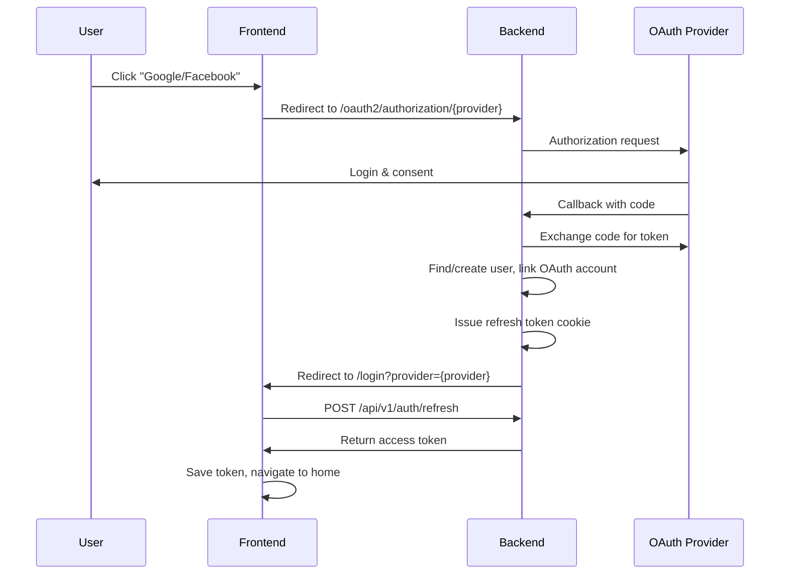

# Tích hợp OAuth2 - Google & Facebook Login

## Tổng quan

Hệ thống đã tích hợp đăng nhập bằng **Google** và **Facebook** thông qua Spring Security OAuth2.

## Backend Configuration

### 1. OAuth Providers Supported
- ✅ Google OAuth2
- ✅ Facebook OAuth2

### 2. Environment Variables Required

Cần cấu hình trong `.env` hoặc `application.yml`:

```env
# Google OAuth
GOOGLE_CLIENT_ID=your-google-client-id
GOOGLE_CLIENT_SECRET=your-google-client-secret

# Facebook OAuth
FACEBOOK_CLIENT_ID=your-facebook-app-id
FACEBOOK_CLIENT_SECRET=your-facebook-app-secret

# Base URLs
BASE_URL=http://localhost:8089
FRONTEND_URL=http://localhost:5173
```

### 3. Backend Endpoints

#### OAuth Authorization Flow
```
GET /oauth2/authorization/google    # Bắt đầu Google login
GET /oauth2/authorization/facebook  # Bắt đầu Facebook login
```

Backend xử lý callback tự động và redirect về frontend với:
```
http://localhost:5173/login?provider=google
http://localhost:5173/login?provider=facebook
```

#### OAuth Account Management
```
GET /api/v1/auth/oauth2/link/{provider}          # Link OAuth account
DELETE /api/v1/auth/oauth2/link/{provider}       # Unlink OAuth account
GET /api/v1/me/linked-account                    # Xem các tài khoản đã liên kết
```

### 4. OAuth2LoginSuccessHandler

**File:** `backend/src/main/java/com/example/backend/handler/OAuth2LoginSuccessHandler.java`

**Flow:**
1. Nhận OAuth callback từ Google/Facebook
2. Extract: email, name, avatar, provider_user_id
3. Tìm user theo `provider` + `provider_user_id` trong `oauth_accounts`
4. Nếu không tìm thấy → Tìm hoặc tạo user theo email
5. Link OAuth account vào `oauth_accounts` table
6. Issue refresh token cookie
7. Redirect về frontend: `${FRONTEND_URL}/login?provider={provider}`

**Providers extraction:**
```java
// Google
email: user.getAttribute("email")
name: user.getAttribute("name") or given_name + family_name
avatar: user.getAttribute("picture")
provider_user_id: user.getAttribute("sub")

// Facebook
email: user.getAttribute("email")
name: user.getAttribute("name")
avatar: user.getAttribute("picture.data.url")
provider_user_id: user.getAttribute("id")
```

## Frontend Implementation

### 1. Files Modified

#### `frontend/src/pages/Login.tsx`
- ✅ Thêm `useSearchParams` để detect OAuth callback
- ✅ Thêm `useEffect` để xử lý `?provider=google/facebook`
- ✅ Gọi `refreshToken()` để lấy access token từ refresh cookie
- ✅ Handler `handleOAuthLogin()` redirect đến backend OAuth endpoint
- ✅ Update Google và Facebook buttons với `onClick` handler

#### `frontend/src/pages/Register.tsx`
- ✅ Thêm OAuth buttons (Google & Facebook)
- ✅ Handler `handleOAuthLogin()` redirect đến backend
- ✅ UI divider "Hoặc đăng ký bằng"

#### `frontend/.env`
```env
VITE_API_BASE_URL=http://localhost:8089
```

### 2. OAuth Flow Frontend



### 3. Code Changes

**Login.tsx - OAuth Handler:**
```tsx
const handleOAuthLogin = (provider: 'google' | 'facebook') => {
    const backendUrl = import.meta.env.VITE_API_BASE_URL || 'http://localhost:8089'
    window.location.href = `${backendUrl}/oauth2/authorization/${provider}`
}
```

**Login.tsx - Callback Handler:**
```tsx
useEffect(() => {
    const provider = searchParams.get('provider')
    if (provider) {
        const handleOAuthCallback = async () => {
            try {
                await refreshToken() // Get access token from refresh cookie
                setSuccess(`Đăng nhập bằng ${provider} thành công!`)
                setTimeout(() => navigate('/', { replace: true }), 1000)
            } catch (err) {
                console.error('OAuth callback error:', err)
            }
        }
        handleOAuthCallback()
    }
}, [searchParams, refreshToken, navigate])
```

**Button Implementation:**
```tsx
<div onClick={() => handleOAuthLogin('google')} className="...">
    <SiGoogle className="text-blue-600 text-xl" />
    <span>Google</span>
</div>

<div onClick={() => handleOAuthLogin('facebook')} className="...">
    <SiFacebook className="text-blue-600 text-xl" />
    <span>Facebook</span>
</div>
```

## Database Schema

### oauth_accounts Table
```sql
CREATE TABLE oauth_accounts (
    id UUID PRIMARY KEY,
    user_id UUID NOT NULL REFERENCES users(id),
    provider VARCHAR(50) NOT NULL,          -- 'google', 'facebook'
    provider_user_id VARCHAR(255) NOT NULL, -- ID từ OAuth provider
    email VARCHAR(255),
    display_name VARCHAR(255),
    linked_at TIMESTAMP NOT NULL,
    last_login_at TIMESTAMP,
    
    UNIQUE(provider, provider_user_id),     -- Một OAuth account chỉ link 1 user
    UNIQUE(user_id, provider)               -- Một user chỉ link 1 account mỗi provider
);
```

## Setup Instructions

### 1. Google OAuth Setup

1. Vào [Google Cloud Console](https://console.cloud.google.com)
2. Tạo project mới hoặc chọn project hiện tại
3. Enable **Google+ API**
4. Tạo **OAuth 2.0 Client ID** (Web application)
5. Thêm Authorized redirect URIs:
   ```
   http://localhost:8089/login/oauth2/code/google
   http://localhost:8089/oauth2/callback/google
   ```
6. Copy **Client ID** và **Client Secret**
7. Paste vào backend `.env`:
   ```env
   GOOGLE_CLIENT_ID=xxx.apps.googleusercontent.com
   GOOGLE_CLIENT_SECRET=GOCSPX-xxxxx
   ```

### 2. Facebook OAuth Setup

1. Vào [Facebook Developers](https://developers.facebook.com)
2. Tạo app mới → Type: **Consumer**
3. Add product: **Facebook Login**
4. Settings → Basic:
   - Copy **App ID** và **App Secret**
5. Facebook Login → Settings:
   - Valid OAuth Redirect URIs:
     ```
     http://localhost:8089/login/oauth2/code/facebook
     ```
6. Paste vào backend `.env`:
   ```env
   FACEBOOK_CLIENT_ID=your-app-id
   FACEBOOK_CLIENT_SECRET=your-app-secret
   ```

### 3. Testing Locally

**Backend:**
```bash
cd backend
./mvnw spring-boot:run
```

**Frontend:**
```bash
cd frontend
npm run dev
```

**Test flow:**
1. Mở `http://localhost:5173/login`
2. Click "Google" hoặc "Facebook"
3. Đăng nhập với tài khoản OAuth
4. Kiểm tra redirect về `/login?provider=google`
5. Verify access token được lưu và redirect về home

## Security Considerations

### 1. CORS Configuration
Backend cần allow frontend origin:
```java
@CrossOrigin(origins = "${app.frontend.base-url}")
```

### 2. Cookie Settings
```yaml
app:
  cookie:
    domain: localhost
    secure: false  # true cho production với HTTPS
```

### 3. Redirect URI Validation
Backend chỉ accept redirect từ:
```java
@Value("${app.frontend.base-url}")
private String frontendUrl;
```

## Troubleshooting

### Issue 1: "redirect_uri_mismatch"
**Cause:** OAuth redirect URI không khớp với cấu hình trong Google/Facebook Console  
**Fix:** Đảm bảo URI trong console chính xác là:
- Google: `http://localhost:8089/login/oauth2/code/google`
- Facebook: `http://localhost:8089/login/oauth2/code/facebook`

### Issue 2: "CORS Error"
**Cause:** Backend không allow frontend origin  
**Fix:** Thêm CORS configuration cho `/oauth2/**`

### Issue 3: "Access token null after callback"
**Cause:** Refresh token cookie không được set  
**Fix:**
1. Kiểm tra cookie domain setting
2. Verify browser không block third-party cookies
3. Check network tab → Response Headers → Set-Cookie

### Issue 4: "User already linked with another account"
**Cause:** OAuth account đã được link với user khác  
**Fix:** Unlink account cũ trước hoặc dùng email khác

## Advanced Features

### 1. Link OAuth to Existing Account

User đã login có thể link thêm OAuth:

**Frontend:**
```tsx
const linkOAuthAccount = async (provider: 'google' | 'facebook') => {
    // Tạo state token với redirect callback
    const redirectUrl = `${window.location.origin}/profile?linked=${provider}`
    window.location.href = `${backendUrl}/api/v1/auth/oauth2/link/${provider}?redirect=${encodeURIComponent(redirectUrl)}`
}
```

**Backend Flow:**
1. Create state token với mode="link"
2. Set oauth_link_state cookie
3. Redirect OAuth flow
4. OAuth2LoginSuccessHandler detect link mode
5. Link OAuth account vào current user
6. Redirect về frontend

### 2. Unlink OAuth Account

```tsx
const unlinkOAuth = async (provider: string) => {
    await api.delete(`/api/v1/auth/oauth2/link/${provider}`)
    alert(`Đã hủy liên kết ${provider}`)
}
```

### 3. View Linked Accounts

```tsx
const linkedAccounts = await api.get('/api/v1/me/linked-account')
// Response: [{ provider: 'google', email: '...', displayName: '...', linkedAt: '...' }]
```

## Production Deployment

### 1. Environment Variables
```env
# Production URLs
BASE_URL=https://api.yourdomain.com
FRONTEND_URL=https://yourdomain.com

# Cookie
COOKIE_DOMAIN=.yourdomain.com
COOKIE_SECURE=true

# OAuth Credentials
GOOGLE_CLIENT_ID=prod-client-id
GOOGLE_CLIENT_SECRET=prod-secret
FACEBOOK_CLIENT_ID=prod-app-id
FACEBOOK_CLIENT_SECRET=prod-secret
```

### 2. Update OAuth Console URIs
```
https://api.yourdomain.com/login/oauth2/code/google
https://api.yourdomain.com/login/oauth2/code/facebook
```

### 3. Frontend .env
```env
VITE_API_BASE_URL=https://api.yourdomain.com
```

## Testing Checklist

- [ ] Click Google button → Redirect to Google login
- [ ] Login with Google → Redirect back with ?provider=google
- [ ] Access token saved in localStorage
- [ ] Navigate to home page successfully
- [ ] Click Facebook button → Redirect to Facebook login
- [ ] Login with Facebook → Redirect back with ?provider=facebook
- [ ] User info displayed correctly (avatar, name)
- [ ] Logout works correctly
- [ ] Re-login with same OAuth account
- [ ] Link multiple OAuth accounts to one user
- [ ] Unlink OAuth account
- [ ] View linked accounts in profile

## References

- [Spring Security OAuth2 Client](https://docs.spring.io/spring-security/reference/servlet/oauth2/client/index.html)
- [Google OAuth2 Documentation](https://developers.google.com/identity/protocols/oauth2)
- [Facebook Login Documentation](https://developers.facebook.com/docs/facebook-login)

---
**Last Updated:** 2025-10-30  
**Status:** ✅ Fully Implemented
